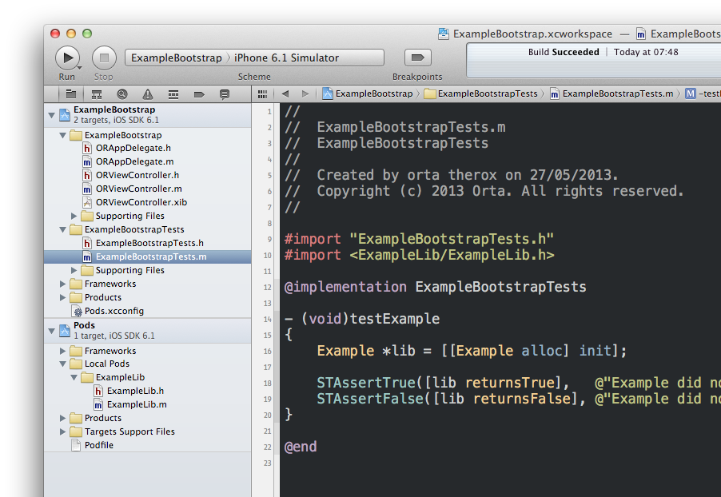

CocoaPods Example Library
================

It can be a bit confusing figuring out the perfect way to set up your library for Cocoapods. We recommend that you create the library in the root of your project like normal, create an Xcode project that uses your library, and then use CocoaPods with the [:path](http://docs.cocoapods.org/podfile.html#pod) property in your [Podfile](https://github.com/orta/CocoapodsExampleLibrary/blob/master/Example/Podfile) to refer to your library.

This means you can work on your library, test it and know that the changes are being propagated to the correct files. Doing it this way means you can keep your dependencies outside of the project, you can edit your files in Xcode ( no `pod install` to pull in changes. ) and you can be sure the [Podspec](https://github.com/orta/CocoapodsExampleLibrary/blob/master/ExampleLib.podspec) works exactly as expected for other users.

The official documentation for this is still work-in-progress but can be found on the new [guides.cocoapods.org repo](https://github.com/CocoaPods/guides.cocoapods.org/blob/master/guides/making-a-cocoapod.md#how-do-i-create-a-new-pod).

